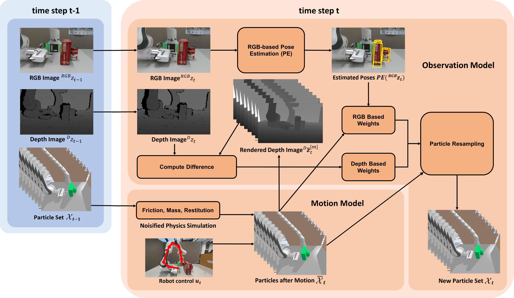

# 🏔️ Physics Based Particle Filtering (PBPF) | Easy to run!


[[Project page]]()
[[Paper]]()
[[Data]](https://leeds365-my.sharepoint.com/:f:/g/personal/scsmrd_leeds_ac_uk/Ej3ecEm8XFdDud6IfLTSw_sBTkiq29Wiul8XWYB9Xhzaug?e=Rpj9qy)

[Zisong Xu](https://github.com/ZisongXu)<sup>1</sup>,
[Rafael Papallas](https://rpapallas.com)<sup>1, 2</sup>,
[Jaina Modisett](https://github.com/citrus-tree)<sup>1</sup>,
[Markus Billeter](https://github.com/billeter)<sup>1</sup>,
[Mehmet R. Dogar](https://github.com/mdogar)<sup>1</sup>

<sup>1</sup>University of Leeds,
<sup>2</sup>American University of Beirut - Mediterraneo





This is the official implementation of the paper, Tracking and Control of Multiple Objects during Non-Prehensile Manipulation in Clutter, to be accepted by The IEEE Transactions on Robotics (T-RO).


**Abstract:** We propose a method for 6D pose tracking and control of multiple objects during non-prehensile manipulation by a robot. The tracking system estimates objects' poses by integrating physics predictions, derived from robotic joint state information, with visual inputs from an RGB-D camera. Specifically, the methodology is based on particle filtering, which fuses control information from the robot as an input for each particle movement and with real-time camera observations to track the pose of objects. Comparative analyses reveal that this physics-based approach substantially improves pose tracking accuracy over baseline methods that rely solely on visual data, particularly during manipulation in clutter, where occlusions are a frequent problem. The tracking system is integrated with a model predictive control approach which shows that the probabilistic nature of our tracking system can help robust manipulation planning and control of multiple objects in clutter, even under heavy occlusions.

<br>

# 🎥 Supplementary Video:

Click to watch the video.

[](https://youtu.be/7Y8KFVrvDhU)


<!-- # Brief Description:

We propose a method to track the pose of an object over time, by using the image from the camera, and the particles in the physical engine. Although sometimes the camera cannot see the object clearly, our method can still track the pose of the object. -->


<br>

# 🛠️ Quick Setup and Installation:

We recommend using the Singularity container provided in our codebase (see the [Singularity installation guide](https://docs.sylabs.io/guides/3.0/user-guide/index.html)) to run the PBPF algorithm.


1. **Download Code**

	```bash
	user@pcName:~/<repo_dir>$ git clone --recurse git@github.com:ZisongXu/PBPF.git
	```

2. **Build and Run Container**

	```bash
	user@pcName:~/<repo_dir>$ cd PBPF
	user@pcName:~/<repo_dir>/PBPF$ ./build.sh
	user@pcName:~/<repo_dir>/PBPF$ ./run.sh
	[PBPF] Singularity> ~/catkin_ws $ cd ~
	[PBPF] Singularity> ~ $ 
	```

	Press `ctrl+D` to exit the `[PBPF]` container.


3. **Download and Setup Rendering Code**

	```bash
	user@pcName:~/<repo_dir>/PBPF$ cd home
	user@pcName:~/<repo_dir>/PBPF/home$ git clone --recurse git@github.com:billeter/pyvkdepth.git
	user@pcName:~/<repo_dir>/PBPF/home$ cd ..
	user@pcName:~/<repo_dir>/PBPF$ ./run.sh
	[PBPF] Singularity> ~ $ cd pyvkdepth
	[PBPF] Singularity> ~/pyvkdepth $ ./premake5 gmake2
	[PBPF] Singularity> ~/pyvkdepth $ make -j8 or make -j8 config=release_x64
	```

4. **Prepare Scripts**

	Move the files from the `sh_scripts` folder in repo's `home` directory to the `pyvkdepth` folder in the `home` directory.

	**Origianl directory:**

	```
	./PBPF/home
	├── catkin_ws
	├── project
	├── pyvkdepth
	├── sh_scripts
	│   ├── automated_experiments.sh
	│   ├── get_info_from_rosbag.py
	│   └── update_yaml_file_automated.py
	├── .bashrc
	├── .cache
	└── .local
	```

	**New directory:**

	```
	./PBPF/home
	├── catkin_ws
	├── project
	├── pyvkdepth
	│   ├ ...
	│   ├── automated_experiments.sh
	│   ├── get_info_from_rosbag.py
	│   └── update_yaml_file_automated.py
	├── sh_scripts # empty
	├── .bashrc
	├── .cache
	└── .local
	```

5. **Download Rosbags** (For running demos only)
	
	```bash
	[PBPF] Singularity> ~/pyvkdepth $ mkdir rosbag
	```

	Download the [rosbags](https://leeds365-my.sharepoint.com/:f:/g/personal/scsmrd_leeds_ac_uk/Ej3ecEm8XFdDud6IfLTSw_sBTkiq29Wiul8XWYB9Xhzaug?e=Rpj9qy) (approximate 2.6TB). If you can not access the URL, please contact us (M.R.Dogar@leeds.ac.uk/xzs1210652636@gmail.com). Put the rosbags into the `./PBPF/home/pyvkdepth/rosbag` folder. Using `3_scene2_crackersoupParmesan2.bag` as an example, you will get `./PBPF/home/pyvkdepth/rosbag/3_scene2_crackersoupParmesan2.bag`.


<br>

# 🦾 Running Code

1. **Enter into the Container**

	```bash
	user@pcName:~/<repo_dir>/PBPF$ ./run.sh
	[PBPF] Singularity> ~ $ 
	```

2. **Start ROS Master**
	
	```bash
	[PBPF] Singularity> ~ $ roscore
	```
	
3. **Using Simulation Time** (Only for using rosbags to run the code)

	```bash
	user@pcName:~/<repo_dir>/PBPF$ ./run.sh
	[PBPF] Singularity> ~ $ rosparam set use_sim_time true
	```


4. **Start Running** (Only for using rosbags to run the code)


	```bash
	user@pcName:~/<repo_dir>/PBPF$ ./run.sh
	[PBPF] Singularity> ~ $ cd pyvkdepth
	[PBPF] Singularity> ~/pyvkdepth $ ./automated_experiments.sh
	```
	
5. **Visualization Window**

	```bash
	user@pcName:~/<repo_dir>/PBPF$ ./run.sh
	[PBPF] Singularity> ~ $ rosrun PBPF Visualisation_World_Particle.py
	```
	

The above steps cover the entire process of running the code, but to ensure it runs smoothly, you need to make sure the file configurations are correct.

<!-- 	
4. **Edit Config Information** (if desired) in ```~/catkin_ws/src/PBPF/config/parameter_info.yaml```

	- ```err_file```: Name of the folder where the error.csv file is saved
	- ```gazebo_flag```: Use gazebo or not (True/False)
	- ```object_name_list```: List of target objects names (["cracker", "soup", ...])
	- ```object_num```: Number of target objects tracked
	- ```other_obj_num```: Number of other objects
	- ```oto_name_list```: List of other objects names
	- ```otob_name_list```: List of other obstacles names
	- ```particle_num```: Number of particles
	- ```pick_particle_rate```: Percentage of particles selected as DOPE poses
	- ```robot_num```: Number of robot
	- ```run_alg_flag```: Name of algorithm (PBPF/CVPF)
	- ```task_flag```: Name of task ('1'/'2'/'3'/'4')
	- ```update_style_flag```: Name of the method used (time/pose)
	- ```version```: whether to use ray tracing (old/multiray) -->
	

<br>

# ⚙️ Bake OBjects


